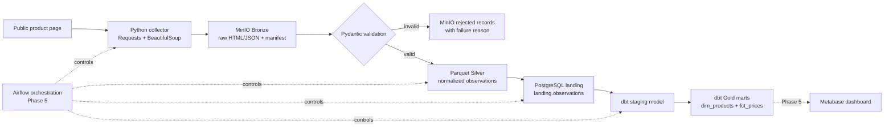
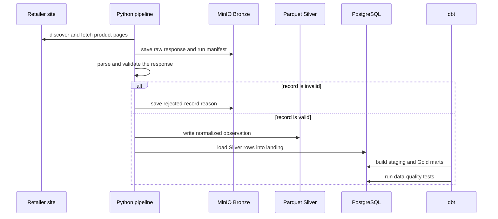
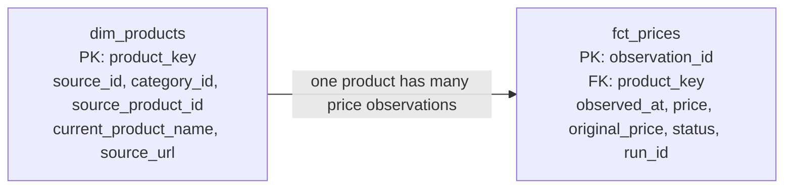

# Retail Price Intelligence Pipeline

An end-to-end data engineering portfolio project for monitoring public product-price observations across Indonesian electronics retailers.

The project turns product pages into a reliable price-history dataset: raw evidence is retained first, validated records are stored as analytics-friendly files, and dbt builds warehouse tables that a dashboard can query.

> **Current status:** Phase 1–4 are implemented and validated locally. Phase 5 (Airflow, GitHub Actions, and Metabase) is the planned reliability and delivery layer; it is not yet implemented.

## The business question

For a product category, answer questions such as:

- What is the latest observed price of a product at each retailer?
- How has a product's price changed over time?
- Which retailer has a listed product available today?

The pipeline is designed for historical observations. A price is not overwritten: every successful collection becomes a new observation.

## Scope

| Area | Current scope |
|---|---|
| Retailers | Eraspace, Electronic City, Digimap, and Erablue |
| Categories | Smartphone, tablet, and laptop |
| Collection approach | Python HTTP requests and HTML parsing, with source-specific discovery rules |
| Warehouse output | Product dimension and append-only price fact table |

This gives the project a 4 retailer × 3 category collection matrix while keeping the portfolio scope intentionally small and understandable.

## Architecture



### Why the layers exist

| Layer | Simple explanation | Engineering reason |
|---|---|---|
| Bronze | The original package is kept before it is opened. | Raw HTML/JSON, request metadata, manifests, and rejected-record reports give an audit trail when a website changes. |
| Silver | Clean, checked product observations. | Parquet keeps validated rows compact, typed, and append-only for historical analysis. |
| PostgreSQL landing | The handover table before analytics. | It is the stable database input for dbt. The loader can safely repeat a run without duplicating that run's rows. |
| Gold | Tables designed for asking business questions. | dbt creates tested `dim_products` and `fct_prices` marts instead of exposing raw collector output to users. |

## Data flow in one run



## Warehouse model



- **`dim_products`** keeps the latest known identity and link for each retailer product.
- **`fct_prices`** keeps every observed price point. This is the table used to calculate price history and trends.

## Data quality and reliability already implemented

- Pydantic validates product observations before they enter Silver.
- Invalid records are retained with their failure reason instead of silently disappearing.
- Bronze retains the original raw response, so parser failures can be investigated later.
- Silver uses a fixed PyArrow schema, which rejects incorrect data types such as text in a price field.
- The PostgreSQL loader removes an existing `run_id` before retrying that same run, preventing duplicated rows from a retry.
- dbt tests enforce required fields and unique keys in both Gold marts.
- Python tests cover extraction, Bronze persistence, Silver schema validation, ingestion failures, and warehouse-load idempotency.

## Tech stack

| Tool | Role in this project |
|---|---|
| Python, Requests, BeautifulSoup | Collect and parse product-page data |
| Pydantic | Validate the product-observation contract |
| MinIO | Store Bronze evidence, manifests, rejected records, and Silver objects |
| PyArrow + Parquet | Write typed, efficient Silver files |
| PostgreSQL | Provide the analytical warehouse landing area |
| dbt Core + dbt-postgres | Build staging/Gold models and run warehouse data tests |
| pytest | Test Python behaviour without depending on live retailer pages |
| Docker Compose | Run local MinIO and PostgreSQL services |
| Airflow | Planned Phase 5 orchestrator |
| GitHub Actions | Planned Phase 5 continuous integration |
| Metabase | Planned Phase 5 analytics dashboard |

## Run locally

### Prerequisites

- Docker Desktop running.
- Anaconda Python environment used by this project. The current working environment is Python 3.11.

### Start the current local platform

Create a local `.env` file from the safe template first, then replace the two placeholder values with your own local-only passwords:

```powershell
Copy-Item .env.example .env
```

`.env` is ignored by Git and must never be committed.

```powershell
docker compose up -d
```

This starts MinIO, PostgreSQL, Metabase, and Airflow. Their generated local state is stored in `var/`, which is ignored by Git.

### Align the terminal with Anaconda

If PowerShell cannot find `dbt`, run this once for the current terminal session:

```powershell
$env:Path = "C:\Users\alvin\anaconda;C:\Users\alvin\anaconda\Scripts;$env:Path"
python --version
dbt --version
```

### Verify the implemented pipeline layers

```powershell
python -m pytest
dbt build --project-dir warehouse --profiles-dir warehouse
```

Expected result: all Python tests pass, then dbt builds the staging model and two Gold marts while passing its data tests.

## Project structure

```text
src/
├── phase1_poc.py       Discovery, fetching, parsing, and Pydantic contracts
├── run_ingestion.py    Bronze-run entry point
├── bronze.py           Raw response, manifest, and rejected-record storage
├── build_silver.py     Bronze replay, validation, and Silver build
├── silver.py           Parquet schema and writer
└── load_warehouse.py   Silver-to-PostgreSQL loader

dags/                   Airflow orchestration

warehouse/
├── models/staging/     dbt source declaration and staging view
└── models/marts/       dbt Gold dimension and fact models

tests/                  pytest coverage for pipeline behaviour
docs/                   architecture and project-layout reference
var/                    ignored local Docker runtime state
```

## Roadmap

| Phase | Outcome | Status |
|---|---|---|
| 1. Discovery & proof of concept | Proved small, public catalogue extraction and field availability. | Complete |
| 2. Ingestion & Bronze | Stored raw evidence, manifests, and rejected-record reports. | Complete |
| 3. Silver & history | Built normalized append-only Parquet observations with schema checks. | Complete |
| 4. Warehouse & Gold | Loaded PostgreSQL and built tested dbt marts. | Complete |
| 5. Reliability & delivery | Airflow DAG, expanded Docker Compose, and Metabase local platform; CI and observability remain next. | In progress |

## What this project demonstrates

- Designing a layered data pipeline instead of a one-off scraper.
- Separating raw evidence, validated data, warehouse landing, and business-facing marts.
- Building historical facts and product dimensions for analytics.
- Treating retries, parser failures, schema checks, and data-quality tests as part of the pipeline design.
- Using dbt to make analytical transformations testable and reviewable.

## Important repository hygiene

Secrets and local runtime data are excluded from version control. The repository does not track `.env`, `var/` service data, dbt build artifacts, or Python caches.
