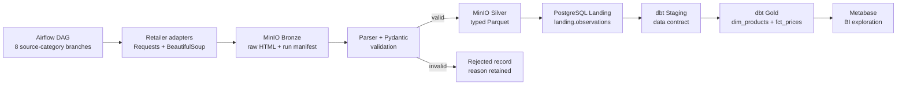
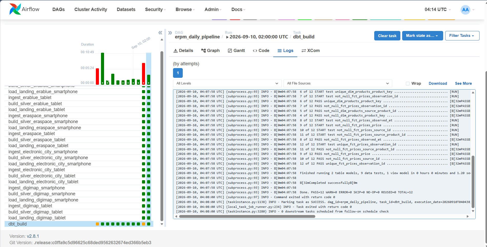
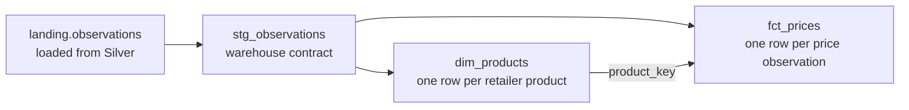

# Retail Price Intelligence Pipeline

> A production-shaped data engineering project that turns public electronics product pages into traceable, tested, analytics-ready price observations.


This repository demonstrates the complete path from source acquisition to analytical data marts: source-specific discovery, raw retention, schema validation, Parquet processing, idempotent warehouse loading, Airflow orchestration, and dbt data-quality checks.

## At a glance

| Capability | Implemented result |
|---|---|
| Data sources | 4 Indonesian electronics retailers: Erablue, Eraspace, Electronic City, and Digimap |
| Comparable scope | Smartphone and tablet observations across all four retailers |
| Orchestration | 8 independent source-category branches coordinated by one Airflow DAG |
| Storage layers | Raw evidence and manifests in MinIO; typed Silver data in Parquet |
| Warehouse | PostgreSQL landing table feeding dbt staging and Gold marts |
| Quality checks | 49 pytest tests and 12 dbt model/data checks |
| Local platform | Airflow, MinIO, PostgreSQL, dbt, and Metabase through Docker Compose |

## Business problem

Retail prices change frequently, source pages differ structurally, and a scraped value is difficult to trust without its original evidence. This pipeline creates a historical observation model that can answer:

- What was the latest observed price for a product at each retailer?
- How did a listed price change between collection runs?
- Which products were available when the observation was made?
- Can every analytical row be traced back to its source response and pipeline run?

A new collection creates a new observation; it does not overwrite price history.

## Architecture



The layers have distinct responsibilities:

| Layer | Responsibility |
|---|---|
| Bronze | Preserve the original response, run manifest, and rejection evidence for audit and replay. |
| Silver | Convert valid observations into compact, typed Parquet files partitioned by source, category, and run. |
| Landing | Load Silver rows into a relational table that dbt can query efficiently. |
| Staging | Define the warehouse-facing contract without coupling marts directly to the Python loader. |
| Gold | Publish a product dimension and price-observation fact table for analysis. |

## Orchestration proof

One DAG run fans out across four retailers and two comparable categories. Each branch completes `ingest -> build_silver -> load_landing`; dbt starts only after every load succeeds.



The DAG deliberately limits active tasks, prevents overlapping DAG runs, and applies retry behavior to transient task failures. A shared pipeline `run_id` connects the Airflow run to MinIO objects and PostgreSQL rows.

## Why this is more than a scraper

| Engineering decision | Why it matters |
|---|---|
| Source-specific discovery strategies | Each retailer can change independently without forcing one brittle universal scraper. |
| Raw-before-transform storage | Parsing can be replayed from Bronze without requesting the website again. |
| Manifest per source/category/run | Discovered, successful, failed, and rejected records remain traceable. |
| Explicit rejected-record path | Invalid data is explained instead of disappearing silently. |
| Fixed PyArrow schema | Type drift is stopped before data reaches the warehouse. |
| Scoped idempotent load | A retry replaces only the same `run_id + source_id + category_id`, preserving other branches. |
| Single dbt fan-in | Gold tables are rebuilt only after the complete ingestion batch reaches Landing. |

## Data model



`dim_products` stores the latest known product identity and source URL. `fct_prices` stores historical price observations, their timestamps, status, source, and pipeline run.

## Quality and reliability

Quality is enforced at several boundaries rather than left to one final check:

- **Pydantic** validates the normalized product-observation contract.
- **Bronze manifests** expose discovery and parsing outcomes for every run.
- **Rejected records** retain the URL and failure reason for investigation.
- **PyArrow** enforces the Silver schema before Parquet is written.
- **Idempotent loading** makes Airflow retries safe at source-category granularity.
- **pytest** covers discovery, parsing, storage, Silver construction, ingestion behavior, package layout, and warehouse loading.
- **dbt tests** enforce unique keys and required analytical fields in both Gold marts.

## Repository map

```text
src/retail_pipeline/
├── discovery.py              Source registry, discovery, parsing, and Pydantic contracts
├── storage/
│   ├── bronze.py             Raw responses, manifests, and rejected records
│   └── silver.py             Typed Parquet schema and MinIO writer
└── jobs/
    ├── ingest.py             Website -> Bronze entry point
    ├── build_silver.py       Bronze replay -> Silver entry point
    └── load_warehouse.py     Silver -> PostgreSQL entry point

dags/erpm_pipeline.py         Multi-source Airflow orchestration
warehouse/models/staging/     dbt source contract and staging view
warehouse/models/marts/       dim_products and fct_prices
tests/                        49 automated Python tests
docs/assets/                  Execution evidence used by this README
var/                          Ignored local service state
```

## Run locally

### 1. Configure local credentials

```powershell
Copy-Item .env.example .env
```

Replace the placeholder passwords in `.env`. The file is ignored by Git.

### 2. Start the platform

```powershell
docker compose up -d --build
```

| Service | Local address |
|---|---|
| Airflow | `http://localhost:8080` |
| MinIO Console | `http://localhost:9001` |
| Metabase | `http://localhost:3333` |
| PostgreSQL | `localhost:5432` |

### 3. Verify the code and DAG

```powershell
python -m pytest
docker compose exec airflow airflow dags list-import-errors
```

The import-error command should return no DAG errors. Trigger `erpm_daily_pipeline` from the Airflow UI to run the full pipeline.

### 4. Run dbt independently

```powershell
docker compose exec airflow bash -lc "cd /opt/airflow/project/warehouse && dbt build --profiles-dir ."
```

### 5. Reconcile a pipeline run

Use the pipeline `run_id` shown in the Airflow task logs:

```sql
SELECT
    source_id,
    category_id,
    COUNT(*) AS rows_loaded
FROM landing.observations
WHERE run_id = 'airflow-YYYYMMDDTHHMMSS'
GROUP BY source_id, category_id
ORDER BY source_id, category_id;
```

This query verifies that every source-category branch reached the warehouse under the same traceable batch identifier.

## What this project demonstrates

- Designing and operating a layered batch data pipeline.
- Modeling replayable Bronze and typed Silver storage.
- Handling heterogeneous external sources through explicit adapters.
- Building retry-safe, traceable multi-branch orchestration in Airflow.
- Applying dimensional modeling with dbt rather than exposing ingestion tables directly.
- Testing code behavior and analytical data contracts separately.
- Running an end-to-end local data platform with reproducible infrastructure.

---

Built as a focused data engineering portfolio project: small enough to understand end to end, structured enough to demonstrate real pipeline engineering decisions.
